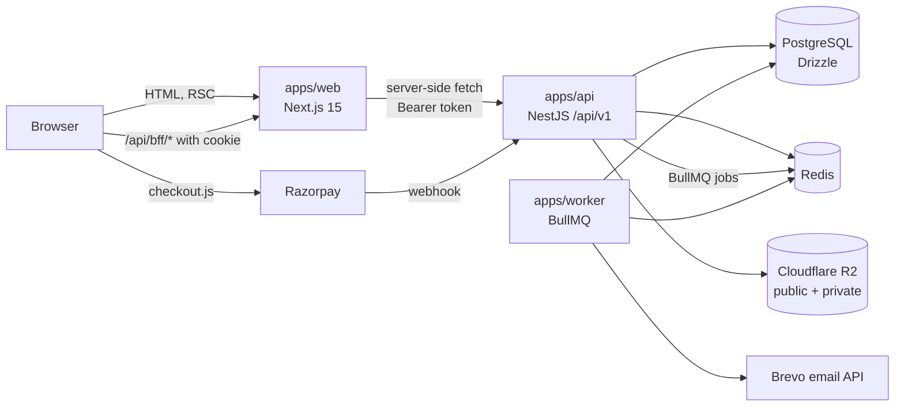
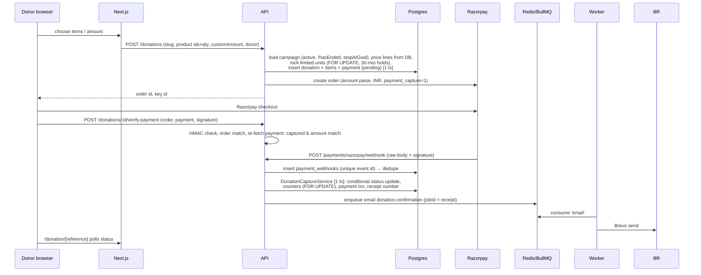

# ARCHITECTURE.md — implemented architecture

Verified against the code on 2026-10-06 (a snapshot). Everything below is **IMPLEMENTED** unless it is labelled **PLANNED**. The original design documents are `docs/architecture.md`, `docs/api-architecture.md` and `docs/phase-0-decisions.md`. Several of their statements are outdated; see `DEVELOPMENT_STATUS.md` §9.

---

## 1. System overview



There are three deployables and one shared database. The packages are consumed as workspace dependencies:
- `packages/database`: Drizzle schema, migrations, client, seed and guarded scripts.
- `packages/validation`: Zod schemas and the shared domain rules.
- `packages/types`: money, API envelope and auth contracts.
- `packages/config`: environment schemas, constants, ESLint and tsconfig presets.
- `packages/ui`: tokens and components.

## 2. Frontend — `apps/web`

- **Framework:** Next.js 15 App Router with React 19 server components by default, and Tailwind v4.
- **Route groups:** `(public)` is the site, `(dashboard)/dashboard` is the donor area, and `admin` holds `admin/login` and `admin/(workspace)`.
- **Public content** goes through `src/lib/content/*`:
  - `loadContent({ fromApi, fallback })` calls the API server-side via `createServerApiClient()` using `API_URL`, with a 10s timeout.
  - When the API fails **and** mock data is enabled, it falls back to fixtures in `src/lib/mock`.
  - `publicCache(tag)` = `{ revalidate: 300, tags: [tag] }`. Admin server actions call `revalidateTag` and `revalidatePath` after writes.
- **Admin data** goes through `src/lib/admin/api.ts` (`adminFetch`, which uses the staff token and `no-store`) and `src/lib/admin/actions.ts`. That file holds about 70 server actions and does no permission checks of its own; the API enforces them.
- **Donor data** goes through `src/lib/donor/*` (`donorFetch`, actions, `readDonorViewer`).
- **BFF** `src/app/api/bff/[...path]/route.ts`: proxies browser calls to the API. It attaches the donor token for `me/*` paths and the staff token for everything else.
- **Middleware** `src/middleware.ts` checks only that the session cookie *exists* for `/admin/*` and `/dashboard/*`. This is for redirect UX; it is not authorization.
- **Tokens:** `src/lib/auth/token-store.ts` keeps one httpOnly JSON cookie per audience: `{accessToken, refreshToken, expiresAt, actor}`. It refreshes 60s before expiry. There is a known risk: a refresh during a server-component render cannot set the cookie (see `SECURITY.md`).
- **SEO:** `src/lib/seo/*` provides `buildMetadata`, canonical URLs, JSON-LD builders and the sitemap segments (route handlers `sitemap*.xml`).
- **Design system:** `packages/ui/src/styles/tokens.css` (OKLCH tokens and utilities such as `hover-lift`, `rise-in`, `band-y` and `rail`), with Radix-based primitives.
- **Homepage composition:** `getComposedPage('home')` reads the page composer's published page. If none exists, the canonical order hard-coded in `src/app/(public)/page.tsx` is used.

## 3. Backend — `apps/api`

- NestJS. The global prefix is `api/v1` (`packages/config` `API_PREFIX`). There are 26 modules (`src/app.module.ts`): Database, Redis, Queue, Audit, Auth, Content, Users, Catalog, Products, Donations, Events, Team, Volunteers, Impact, Me, Donors, Settings, Stories, Blog, Pages, Storage, Media, Documents, Notifications, Reports and Health.
- **Request pipeline:**
  1. `RequestIdMiddleware` sets the request ID.
  2. helmet; HSTS is enabled in production only.
  3. CORS, allow-listed by `CORS_ORIGINS`.
  4. Throttler: Redis Lua storage, global 100/min, with per-route limits.
  5. `AuthGuard`: `@Public`, then bearer JWT, audience, permissions, and the `@Sensitive` freshness check.
  6. A per-route `ZodValidationPipe`.
  7. Controller → service → Drizzle.
  8. `ResponseInterceptor` wraps the result in the envelope.
  9. `AllExceptionsFilter` handles errors.
- **Envelope:** `{success:true,data,meta}` on success and `{success:false,error:{code,message,details,requestId}}` on error. `@RawResponse()` opts out; the webhook uses it.
- **Public content endpoints:** `src/modules/content` covers programmes, campaigns (with `sort=featured`, status filters and search), stories, events, team, impact, blog and pages.
- **Admin endpoints:** under `/admin/*` in each module, guarded by `@RequirePermission`. Sensitive ones also need `@Sensitive` re-authentication.
- **Health:** `GET /api/v1/health` (liveness) and `/health/ready` (DB, Redis, queue).
- **Swagger:** `/api/v1/docs` when `SWAGGER_ENABLED`. Production refuses it.

## 4. Database

PostgreSQL with Drizzle: 47 tables, migrations `0000`–`0022`. RLS is enabled with **no policies** on every table, and the app connects as the owner. Full detail is in `DATABASE.md`.

## 5. Authentication and authorization

```mermaid
sequenceDiagram
  participant B as Browser
  participant W as Next.js (server action / BFF)
  participant A as API AuthService
  participant D as Postgres
  B->>W: email + password (staff) / email + OTP (donor)
  W->>A: POST /auth/staff/login | /auth/donor/otp/verify
  A->>D: verify Argon2id / hashed OTP, create session (token family)
  A-->>W: access JWT (sub,aud,sid; 15m) + opaque refresh token
  W-->>B: Set-Cookie httpOnly sailent_*_session
  B->>W: later request
  W->>A: Authorization: Bearer <access>
  A->>D: session live? load permissions (per request)
  A-->>W: data (envelope)
```

- **Access JWT:** HS256, with a per-audience key derived from `JWT_ACCESS_SECRET`.
- **Refresh tokens:** opaque; stored as SHA-256 in `sessions`; rotated within a family; reuse revokes the family.
- **Authorization:** permission strings, deny-by-default. Permissions are resolved from the database on every request. There is one role, `SUPER_ADMIN`.

## 6. Donation and payment flow (implemented)



- **Not implemented:** a webhook queue (it is processed inline), reconciliation, pending expiry, refunds, and an idempotency key.
- **Ended campaigns:** `hasEnded()` (`packages/validation`) closes a campaign at the end of its `end_date` (IST), both at checkout and in the API's `donation` state. With no `end_date`, a campaign is ongoing.
- **Without Razorpay keys** (local development): the pending donation is committed first, then order creation fails with HTTP 503 and the row stays `pending`. See `DEPLOYMENT.md` §6.

### Homepage Featured Campaigns ordering
- **Live data:** the API orders `GET /api/v1/campaigns?sort=featured` by `is_featured DESC`, `featured_order ASC` (NULLs last), `end_date ASC` (NULLs last), then `created_at`, `id`. The web (`getFeaturedCampaigns()` in `apps/web/src/lib/content/campaigns.ts`) keeps that order, removes campaigns not taking donations (`acceptsDonationsNow()`), and caps the list at 12.
- **Fixture fallback only:** `apps/web/src/lib/featured-campaigns.ts` `orderFeaturedFirst()` applies the same rule to the mock data when the API is unavailable and mock data is enabled. It does not affect live data.
- *(Committed in `dd64d41`, 2026-10-06.)*

## 7. Storage

- `StorageService` (`apps/api/src/modules/storage`) talks to R2 through the AWS S3 SDK.
- **Public bucket:** served through `R2_PUBLIC_BASE_URL`.
- **Private bucket:** read only through presigned GET URLs (15 minutes for media, 5 minutes for documents).
- **Uploads:**
  - multer memory storage;
  - type checked by magic bytes (JPEG, PNG, WebP; plus PDF for documents);
  - size limits of 10 MB (media) and 25 MB (documents);
  - random object keys.
- **No local fallback.** When R2 is not configured, uploads return 503.
- **Web limitation:** `images.remotePatterns` is empty in `apps/web/next.config.ts`, so R2-hosted images cannot be rendered by `next/image` yet. Local images live under `apps/web/public/images`.

## 8. Email, notifications, queues

- **Queue names:** `packages/config` and the worker's `src/queues`.
- **Producer:** the API's `QueueService` (BullMQ). Job IDs avoid colons (`jobKey()`).
- **Worker** (`apps/worker/src/main.ts`) consumes:
  - `example`;
  - `email`, with processors for donation confirmation, the donor login code, event registration and cancellation, and the volunteer messages (application received, approved, rejected, assigned; certificate issued).
- **Declared but unconsumed:** `notifications`, `reports`, `payments`, `cleanup`. The admin "retry" enqueues to `notifications`, so it sends nothing.
- **Job defaults:** 3 attempts with exponential backoff. A staff alert is sent on permanent failure.
- **Templates:** the `notification_templates` table, versioned, with HTML-escaped placeholders.
- **Health:** the worker serves `/health` on `WORKER_PORT` (default 4001).
- **PLANNED:** scheduled jobs (reconciliation, counter drift, cleanup, reminders), SMS, newsletter.

## 9. Caching

- **Next.js data cache:** `revalidate: 300` with tags, revalidated by admin actions. Sitemaps are cached for 3600s.
- **Redis:** throttler counters (Lua script) and BullMQ.
- **No application-level cache** in the API.

## 10. Deployment

- **Exists:**
  - the **production Supabase database** (owner, 2026-10-06). Its state is unverified; agents have no access (`AGENTS.md` §8);
  - local Postgres and Redis;
  - CI.
- **Does not exist:** any staging environment; application hosting.
- **Documented intent (PLANNED):**
  - web on Vercel;
  - api and worker on Render or Railway (persistent processes, decision A12);
  - Supabase Postgres (session pooler on port 5432);
  - Upstash Redis;
  - R2;
  - Cloudflare in front.
- **Not in the repo:** Dockerfiles, IaC, deployment workflow. Cloud Run is not referenced anywhere.
- **Local development:** `infrastructure/docker-compose.yml` (Postgres 17 + Redis 7). See `DEPLOYMENT.md`.

## 11. Monitoring and logging

- **API:** `nestjs-pino` with redaction (auth headers, cookies, password, OTP, token, PAN, phone and email paths). Request IDs are propagated.
- **Worker:** its own pino logger with redaction.
- **Sentry:** PLANNED; the variables exist and no SDK is installed.
- **Audit trail:** the `audit_logs` table records about 60 mutation actions (see `SECURITY.md`).

## 12. Testing architecture

- **Vitest** in every package:
  - web uses jsdom, and `server-only` is aliased to a stub;
  - the API uses SWC.
- **API integration tests** (`apps/api/test`) run against real local Postgres and Redis (`TEST_DATABASE_URL`). They refuse a remote database unless `ALLOW_REMOTE_TEST_DB=true`.
- **Playwright** (`apps/web/e2e`):
  - **Projects:** desktop, tablet (iPad Mini, WebKit), mobile (Pixel 5) and mobile-xs (320px).
  - **Servers:** it starts its own API on 4100 and web on 3100, against `E2E_DATABASE_URL` (`sailent_e2e`) and Redis DB 2.
  - **Global setup** creates the staff and donor sessions.
- **CI** (`.github/workflows/ci.yml`):
  - **quality job:** lint, typecheck, migrate, seed, test, build, format.
  - **security job:** `pnpm audit` and gitleaks.
  - E2E does **not** run in CI.

## 13. Important architectural decisions (implemented)

| Decision | Where |
|---|---|
| A1 Browser never calls the API; BFF + httpOnly cookies | `app/api/bff`, `lib/auth/token-store.ts` |
| A2 Integer paise | `packages/types` `Paise`, `_shared.ts` `money()` |
| A3 Server is the truth for payment | `payment-verification.service.ts` |
| A5 Donation header + snapshotted line items | `donations`, `donation_items` |
| A6 Counters only in the capture transaction | `donation-capture.service.ts` |
| A7 Gapless per-FY receipts | `receipts.service.ts`, `receipt_sequences` |
| A9 Permission strings, deny-by-default, 5-minute re-auth | `auth.guard.ts`, `@Sensitive` |
| A12 Persistent API process with a real connection pool | `packages/database/src/client.ts` |
| A13 `VOL-YYYY-NNNNN` gapless volunteer IDs | `volunteer_sequences` |
| A14 No number unless the database produces it | content layer and components |
| Shared domain rules in `packages/validation` | lifecycle, progress, `hasEnded`, composition |

Decisions that are **not** implemented as documented:
- **A4:** the webhook is processed inline, not through a queue.
- **A8:** TOTP is not in effect.
- **A10:** there is no database-level audit-log immutability.

See `DEVELOPMENT_STATUS.md` §9.
